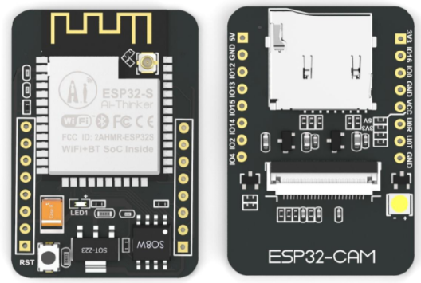
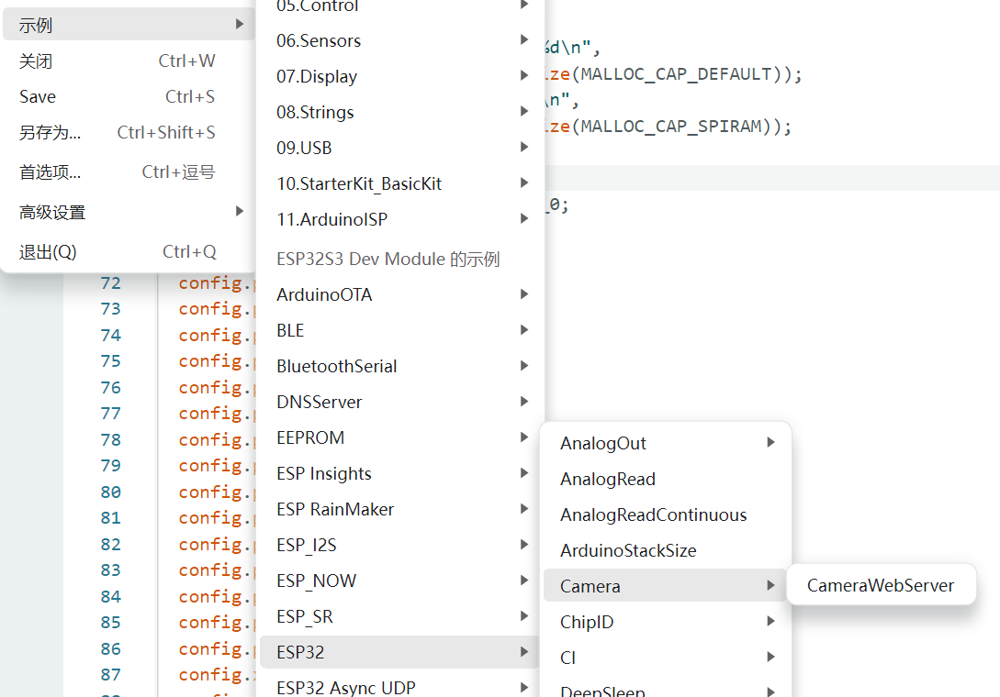
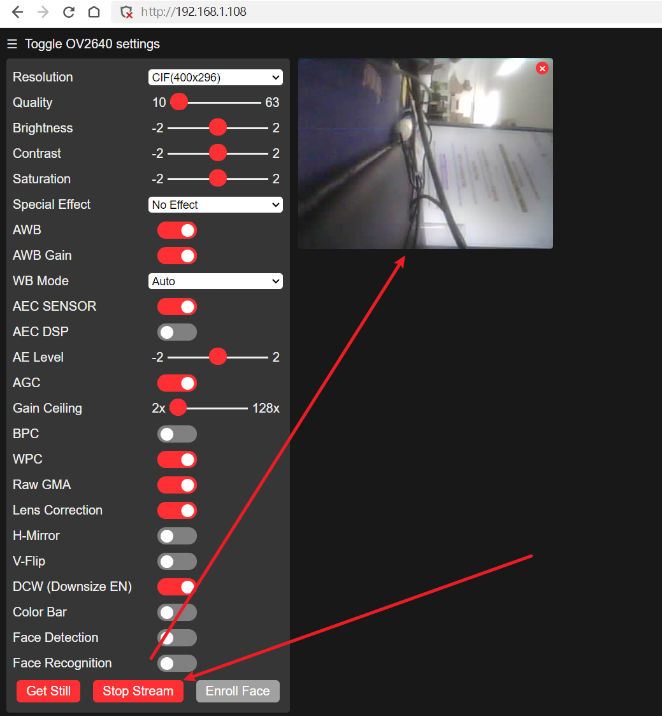

## ESP32CAM 简介

ESP32CAM 是一款集成了 ESP32 和 OV2640 摄像头的开发板，可以用来做一些有趣的项目。




## 跑跑例程

使用Arduino IDE，安装好 ESP32 的开发环境，然后打开 `File -> Examples -> ESP32 -> Camera -> CameraWebServer` 这个例程。



在 `CameraWebServer.ino`的注释中选择合适的开发板，我这里选择的是 `AI Thinker ESP32-CAM`。就是取消选择的开发板的注释，然后注释掉其他的开发板。

```cpp
// ===================
// Select camera model
// ===================

#define CAMERA_MODEL_AI_THINKER // Has PSRAM
```

然后修改 `CameraWebServer.ino` 中的 `ssid` 和 `password` 为你的 WiFi 的 SSID 和密码。

```cpp

const char* ssid = "your-ssid";
const char* password = "your-password";

```

然后编译、烧录，打开串口监视器，可以看到串口输出的 IP 地址，用浏览器打开这个 IP 地址，就可以看到摄像头的实时画面了。


## 踩坑记录

### 1. 奇怪报错

指向flash的报错，查询后未得到明确解决方案，但是不影响使用。

```console
E (568) esp_core_dump_flash: No core dump partition found!
E (568) esp_core_dump_flash: No core dump partition found!
```

### 2. 无法连接 WiFi

在 `CameraWebServer.ino` 中修改 `ssid` 和 `password` 后，编译、烧录，但是无法连接 WiFi，后来换了华为平板的热点就可以了，可能是公司路由器的问题。

## 参考

- [https://blog.csdn.net/qiaoyurensheng/article/details/131726234](https://blog.csdn.net/qiaoyurensheng/article/details/131726234)
- [https://blog.csdn.net/gygkhd/article/details/139230579](https://blog.csdn.net/gygkhd/article/details/139230579)
